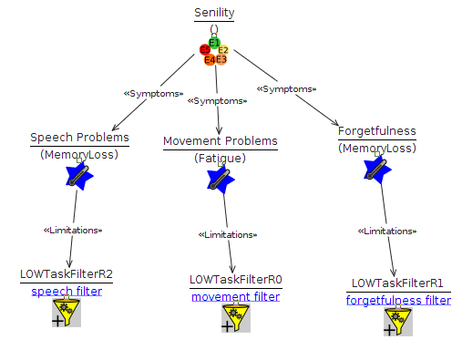
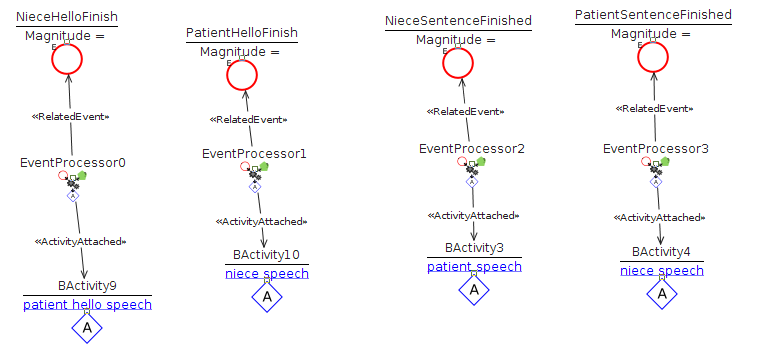
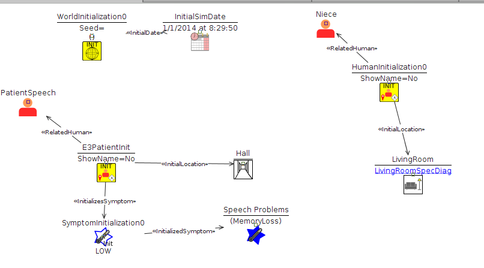
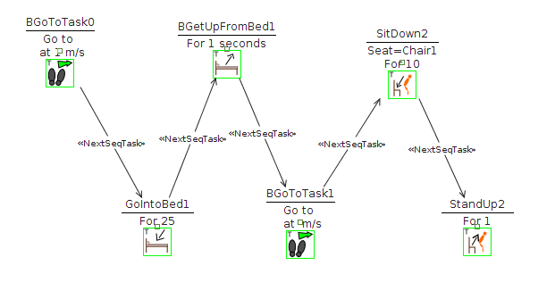
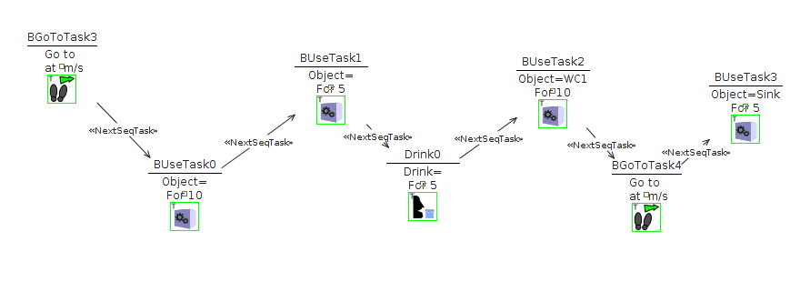

#Description
This project focuses on the interview to patient E3. 

The patient is an 86 year old female who was diagnosed as having an incipient senility 4 or 5 years ago, when she started noticing she sometimes forgot words and phone numbers.

She lives alone but her two sisters and niece live closeby. Although she is capable of doing almost every day to day chore she is taken care by her small sister and niece who do almost everything for her.

The problems they report she has are the following:

* Sometimes when speaking she forgets words. She is aware of that.
* Routinely forgets dates and times for schedules such as doctors.
* Forgets about tasks she has already done like having breakfast.
* She forgets about ever having been in places like the hospital where she usually goes.
* Has difficulties when she has to take decisions. For example at one time her house flooded and  she didn't knew what to do about it.
* Has had mood changes. It is reported that before she was more grumpy but now she seems more calmed and relaxed.
* She has lower energy drive. Nowadays she is more lazy while before she was always doing things.

She is mostly aware of her illness and age and has more or less accepted she is close to death. This results in a better character and humour and giving less importance to small things.

---

Three different simulations have been made that try to mimic some of these symptoms as close as possible. The symptoms are the following:

---

##Patient sometimes forgets words

For this case we modelled a conversation and made a filter that makes her unable to speak on occasion.

An InteractionDiagram was created that tries to simulate a conversation between both agents.

The filter for this symptom was implemented using a filter of the type unable with a low probability (0.075) of this event happening.

The resulting initialization of the simulation is as follows:

---

##Patient is described as having a lower energy drive

In this case we made a simple sequence of getting in & out of bed, moving and using a chair. A filter is then applied that makes these actions take a longer time.

The sequence of movements the agent performs is this:

For this symptom we used a delay filter that makes her act more slowly (50%)

The resulting initialization is the following:

---

##Patient sometimes forgets a task she was about to perform

For this simulation a sequence of task was constructed that tries to mimic typical actions performed in the morning such as showering. A filter is then applied that cancels some of the tasks that have to be performed.

The movements the agent makes are these:

For this symptom we used a replace task filter that changes the task to one in which the agent states out loud she doesn't know what to do. The filter then is:

To init the simulation we apply the following variables

---